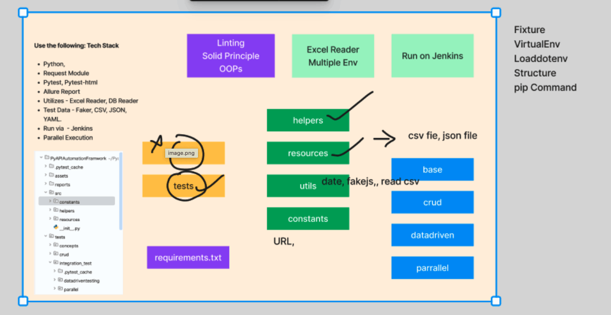

#🚀 Python API Automation Framework
📌 Overview

This repository contains a Hybrid Custom API Automation Framework built using Python and PyTest.
The framework is designed to support scalable, maintainable, and data-driven API testing, following best practices commonly used in real-world QA automation projects.

It supports:

REST API testing

Data-driven testing

Schema validation

Parallel execution

Detailed reporting

📂 Framework Structure

The framework follows a well-organized folder structure to ensure readability, reusability, and easy maintenance.

Key design principles:

Separation of test logic, test data, and utilities

Reusable API client methods

Centralized configuration and reporting

🛠️ Tech Stack
Programming Language

Python (Latest Version)

Core Libraries & Tools
Requests – HTTP client for REST API calls
PyTest – Test execution framework
Allure Report – Advanced and interactive test reporting

Test Data Management
CSV – Lightweight, tabular test data
Excel – Structured test data (MS Excel format)
JSON – Payload and configuration data
Faker – Dynamic test data generation
(Useful for testing scenarios like multiple user logins with random credentials)

Advanced API Testing
jsonschema – API response schema validation

Parallel Execution
pytest-xdist – Run tests in parallel to reduce execution time

📦 Package Installation

Install all required dependencies using the command below:

pip install requests pytest pytest-html faker allure-pytest jsonschema

For parallel execution support:

pip install pytest-xdist

▶️ How to Execute Tests
✅ Run a Single Test Case
pytest tests/tests/crud/test_create_booking.py -s

✅ Run Tests with Allure Reporting
pytest tests/tests/crud/test_create_booking.py --alluredir=allure_result -s

Generate and view the Allure report:

allure serve allure_result

✅ Run Tests in Parallel
pytest -n auto

Or specify number of workers:

pytest -n 4

📊 Reporting

Allure Reports provide:

Step-wise execution details

Request/Response visibility

Test trends and history

Failure screenshots/logs (if enabled)

🎯 Key Features

Modular and reusable design

Data-driven API testing

Schema validation for API responses

Parallel execution support

Professional reporting with Allure

Easily extensible for CI/CD integration

🧠 Best Practices Followed

Clear separation of concerns

Reusable API utilities

Externalized test data

Scalable test execution

Industry-standard reporting

📌 Future Enhancements (Optional)

CI/CD integration (Jenkins / GitHub Actions)

Environment-based configuration

Token-based authentication handling

Logging framework integration